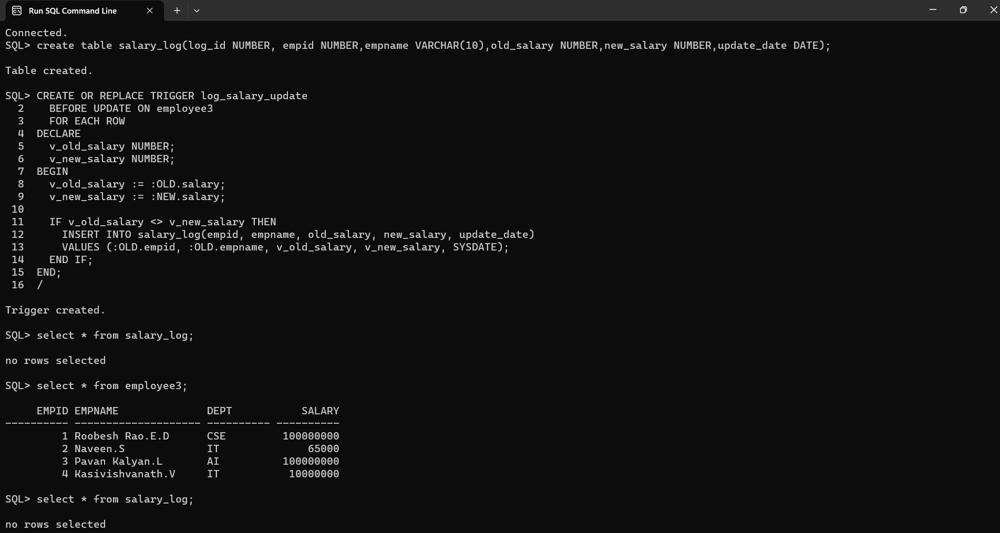
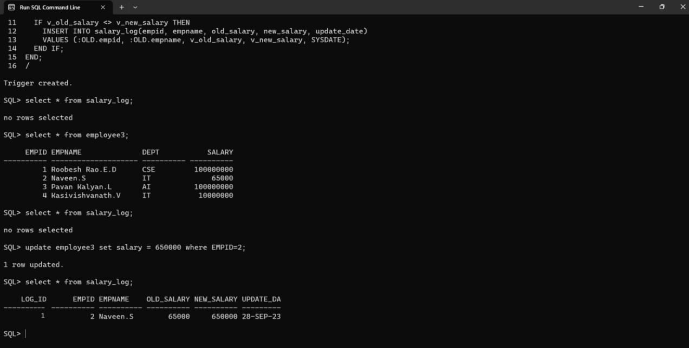

# Ex. No: 5 Creating Triggers using PL/SQL

## AIM: 
To create a Trigger using PL/SQL.

## Steps:
1. Create employee table with following attributes (empid NUMBER, empname VARCHAR(10), dept VARCHAR(10),salary NUMBER);
2. Create salary_log table with following attributes (log_id NUMBER GENERATED ALWAYS AS IDENTITY, empid NUMBER,empname VARCHAR(10),old_salary NUMBER,new_salary NUMBER,update_date DATE);
3. Create a trigger named as log_salary-update.
4. Inside the trigger block, Insert the values into the salary_log table whenever the salary is updated.
5. End the trigger.
6. Update the salary of an employee in employee table.
7. Whenever a salary is updated for the employee it must be logged into the salary_log table with old salary and new salary.
8. Display the employee table, salary_log table.

## Program:
### Create employee table
```
create table EMPLOYEE3 (empid NUMBER, empname VARCHAR(20), dept VARCHAR(10),salary NUMBER);
```
### Create salary_log table
```
create table salary_log(log_id NUMBER, empid NUMBER,empname VARCHAR(10),old_salary NUMBER,new_salary NUMBER,update_date DATE);
```
### PLSQL Trigger code
```
 CREATE OR REPLACE TRIGGER log_salary_update
  2    BEFORE UPDATE ON employee3
  3    FOR EACH ROW
  4  DECLARE
  5    v_old_salary NUMBER;
  6    v_new_salary NUMBER;
  7  BEGIN
  8    v_old_salary := :OLD.salary;
  9    v_new_salary := :NEW.salary;
 10
 11    IF v_old_salary <> v_new_salary THEN
 12      INSERT INTO salary_log(empid, empname, old_salary, new_salary, update_date)
 13      VALUES (:OLD.empid, :OLD.empname, v_old_salary, v_new_salary, SYSDATE);
 14    END IF;
 15  END;
 16  /
```
## Output:


## Result:
Hence trigger has been created using PL/SQL.
